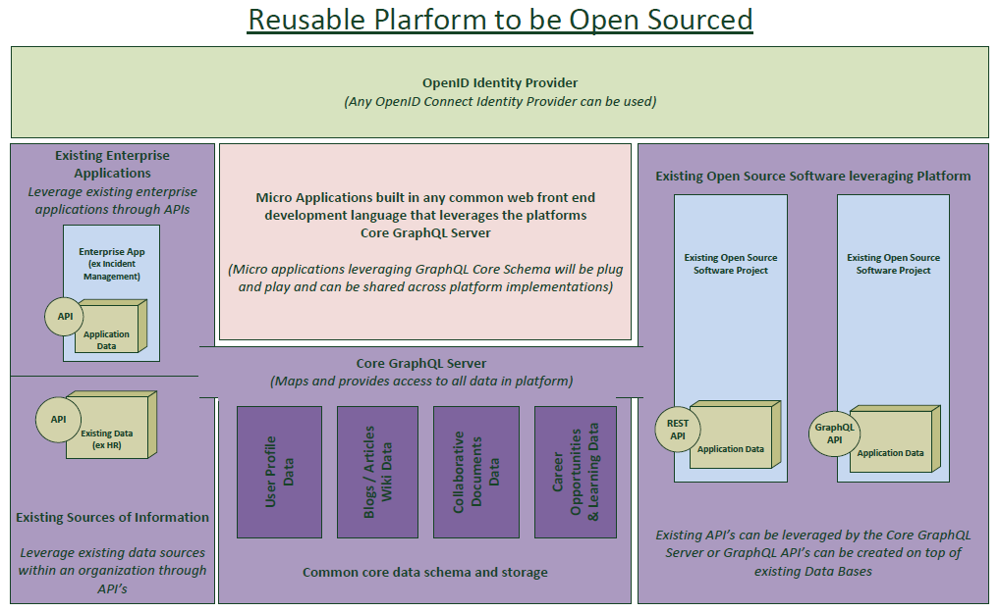

<helmet>
<title> Architecture - Introduction </title>
</helmet>

## Architecture

Quantum architecture is built around GraphQL (Prisma and Apollo), a Message Queue, and ElasticSearch.  These basic components provide the foundational services that enable all applications within the Open Accessible Digital Workspace.

The driving concept behind this architecture is that any application could be a part of the Open Accessible Digital Workspace even without being built specifically for it.  Many different levels of integration are possible, with the level of integration increasing exponentially with the number of APIs available for the application.

The image below was created early on when building this architecture but still captures the spirit of what is being achieved using this solution. 

