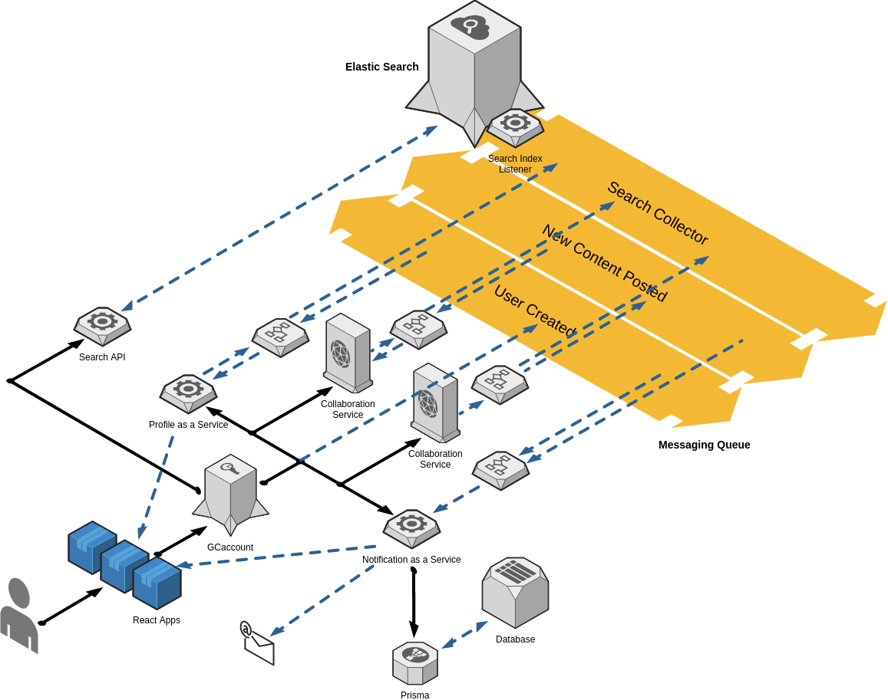

<helmet>
<title> Architecture - System Architecture </title>
</helmet>

## System Architecture

The Quantum system relies on foundational micro-services, an event-driven message queue, and a JSON Web Token-based authentication provider.

Foundational Micro Services:
* [Profile as a service](/profile/introduction)
* [Notification as a Service]()
* [Search as a Service]()

Collaboration services in the image below represent services that are not foundational but are integrated in the Quantum architecture (e.g. Career Marketplace, Discussions, etc.)

The message queue provides publication/subscription event-handling for all connected services. An application does not need to connect to a separate API service-by-service but instead post a global message to an event.  All listening services subscribed to that event will then receive a copy of the information to be handled internally.

React Apps identified below are the Single Page Applications (SPA) that provide the visual window into the possibilities of Quantum. The possibilities of what Quantum can create are limitless: from simple applications like Directory, that focus on one key informational component, to Career Marketplace that can have a wider focus and more complex interactions.  With a user always in complete control of the data an application can access, the security of information is in the user's hands.  

