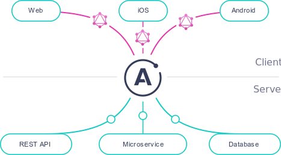

<helmet>
<title> Architecture - Underlying Technology </title>
</helmet>

## Underlying technology

### Django

The Django application framework has robust web service development capabilities, ease of language comprehension, and the ability to quickly prototype application ideas. We chose Django because:

* You can develop fast: Django is designed to help developers make an application as fast as possible.  From idea to production to release, Django helps development be both cost effective and efficient.
* It is fully loaded: Django includes dozens of extras to help with user authentication, site maps, content administration, RSS feeds and much more. These extras help carry out the web development process completely.
* It is scalable: The Django framework can meet the heaviest traffic demand.  Large organizations leveraging Django include Pinterest, Instagram, and BitBucket.

### React.js

React.js is a Javascript framework that is great for developing Single-page applications (SPAs) that are amazingly fast and responsive.

### Apollo

Apollo Server allows to quickly build a production-ready, self-documenting API for GraphQL clients, using data from any source.  It's open-source and works great as a stand-alone server, an addon to an existing Node.js HTTP server, or in "serverless" environments.

### Prisma

Prisma is an excellent tool for building GraphQL servers. The Prisma client is compatible with the Apollo ecosystem, has default support for GraphQL subscriptions and Relay-style pagination, provides end-to-end type safety and comes with a built-in dataloader to solve the N+1 problem.

### GraphQL

GraphQL is an application layer query language. GraphQL is designed to interpret a string from a server or client and return data in an understandable, stable, and predictable format.  As the `official website for GraphQL puts it <https://graphql.org/>`_, "Describe your data, ask for what you want, get predictable results."

#### Benefits of GraphQL

* Elegant data retrieval
* Back-end stability
* Query efficiency
* GraphQL is a specification

#### Who Uses It

* Facebook
* GitHub
* Twitter
* Yelp
* wayfair
* neo4j
* GRAPHCOOL