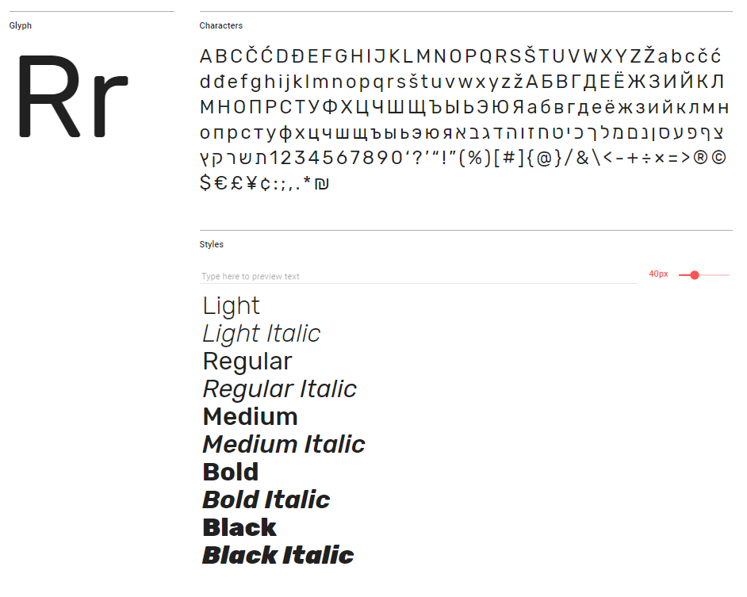
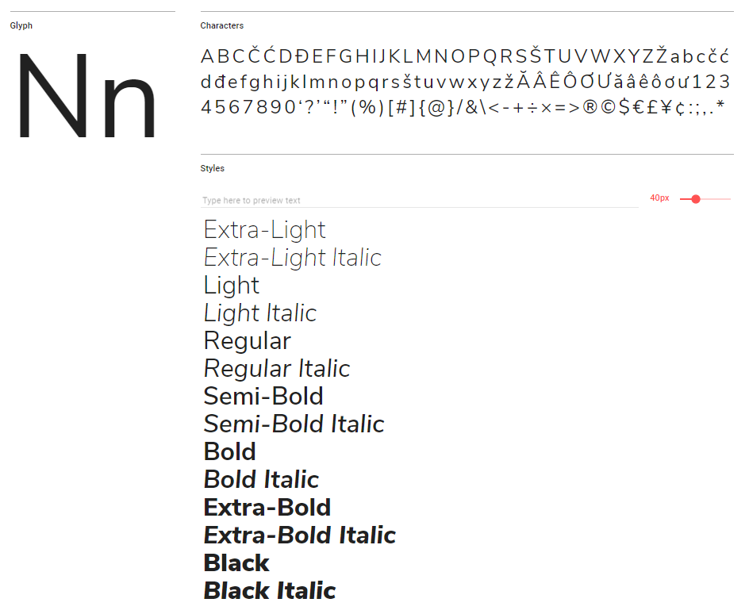

<helmet>
<title> Typography - Aurora Design System </title>
</helmet>

# Typography

## Fonts

The Digital Collaboration Division uses two font families for all digital products: Rubik and Nunito Sans. Both Rubik and Nunito Sans are open source fonts and can be downloaded from [Google Fonts](https://fonts.google.com/) for free.

[Rubik](https://fonts.google.com/specimen/Rubik) is used for titles and headings, while [Nunito Sans](https://fonts.google.com/specimen/Nunito+Sans) is used for sub-headings, buttons and paragraph text.

**Rubik**

**Nunito Sans**

### Font Choice

Both fonts chosen for this design system enhance accessibility and readability. Sans-serif fonts have a simpler structure than serif and script fonts, so users with reading disabilities or visual impairments are able to more easily decipher characters.

If you choose to use fonts other than the ones listed here, it is recommended that your digital product use sans-serif rather than serif or script fonts.

Some systems may not be able to download or display the fonts in this design system. This can be for a variety of reasons including firewall restrictions, accessibility settings, etc. In this case your application should be set to use the browser's default font.

### About the Typefaces

**Rubik** is a sans-serif font designed by Philipp Hubert and Sebastian Fischer for the Chrome Cube Lab project. With 5 different weights, Rubik works well as a paragraph or display font. Rubik is popular internationally and is used in more than 180,000 websites.

**Nunito Sans** is part of Google's super family typefaces. It was created by Vernon Adams and improved by Jacques Le Bailly to include a full set of weights. This font is popular all over the world and is used by 50,000 websites.

## Titles \(H1\)

<h1>Heading 1</h1>

<codeblock html='<h1>Heading 1</h1>'
    react='<h1>Heading 1</h1>'>
</codeblock>

Titles appear only on the top of pages and indicate high-level navigation points.

Titles are displayed using Rubik Light at 36 points  in the colour <badge style="background-color: #252525">#252525</badge> on a light background or <badge style="background-color: #FFFFFF;color:black;">#FFFFFF</badge> on a dark background.

## Headings \(H2-H6\)

    <h2>Heading 2</h2>
    <h3>Heading 3</h3>
    <h4>Heading 4</h4>
    <h5>Heading 5</h5>
    <h6>Heading 6</h6>

<codeblock html='
    

        <h2>Heading 2</h2>
        <h3>Heading 3</h3>
        <h4>Heading 4</h4>
        <h5>Heading 5</h5>
        <h6>Heading 6</h6>
    
'
    react='
    

        <h2>Heading 2</h2>
        <h3>Heading 3</h3>
        <h4>Heading 4</h4>
        <h5>Heading 5</h5>
        <h6>Heading 6</h6>
    
'>
</codeblock>

There are five different sub-headings. All sub-headings use the colours <badge style="background-color: #252525">#252525</badge> on a light background or \#FFFFFF on a dark background.

The headers use the following typographic styles:

**Heading 2:** Rubik Regular at 28 points \(1.75 em\).

**Heading 3:** Rubik Medium at 24 points \(1.5 em\) with a tracking modifier set to 10.

**Heading 4:** Rubik Regular at 21 points \(1.3125 em\).

**Heading 5:** Nunito Sans Regular at 18 points \(1.125 em\).

**Heading 6:** Nunito Sans Bold at 16 points \(1em\).

## Paragraph Text

Paragraph text is used for most text content found on the application. Paragraph text is set to Nunito Sans Regular at 16 points \(1em\) with a leading of 24 points. Unless indicating a hyperlink or navigation point, paragraph text should not have added emphasis.

Paragraph text uses the colours <badge style="background-color: #252525">#252525</badge> on a light background or <badge style="background-color: #FFFFFF; color:black;">#FFFFFF</badge> on a dark background.

### Line-Breaking

The DCD design system is consistent with the following best practices for line-breaks:

• Avoid hyphenation at the end of a line.

• Avoid leaving gaps or orphans hanging on a line.

• Avoid overly large indentation.

### Line Length

The ideal length for body text is around 40-60 characters. If line length is too short or too long it has a negative impact on readability. Our design system follows these guidelines and aims for approximately 60 characters per line.

## Pull Quotes

 " What an awesome pull quote! "

<codeblock html='
    
 " What an awesome pull quote! "

' react=''></codeblock>

Pull Quotes are used to indicate key phrases from the content displayed on the page \(i.e. in articles or blogs\). Pull quotes are integrated into paragraphs.

Pull quotes are indented by 50px with a vertical line in the application's secondary colour. The line is 4px wide.  Padding between the line and the text is 8px.  The text is displayed using Nunito Sans Regular at 1.25 em,  with a line height of 200%.

See [_Colour_](colour.md) for more information on choosing accessible colours for your pull quote lines.

## Lists

There are three different types of lists:

**Un-ordered lists:** These lists use bullet points to indicate groups of content. The default bullet is an open circle with an outline in the primary colour. An indented bullet includes an open circle with a grey outline.

<ul>
    <li>Item 1</li>
    <li>Item 2</li>
    <li>Item 3</li>
</ul>

<codeblock html='
    <ul>
        <li>Item 1</li>
        <li>Item 2</li>
        <li>Item 3</li>
    </ul>'
    react=''>
</codeblock>

**Ordered lists:** Ordered lists use numbers to indicate content that requires a hierarchy.

<ol>
    <li>Item 1</li>
    <li>Item 2</li>
    <li>Item 3</li>
</ol>

<codeblock html='
    <ol>
        <li>Item 1</li>
        <li>Item 2</li>
        <li>Item 3</li>
    </ol>'
    react=''>
</codeblock>

**Interactive lists:** Interactive lists include content that is clickable. These lists include a hover and click state, and act as minor navigation points.

<ul>
    <li><a href="#">Item 1</a></li>
    <li><a href="#">Item 2</a></li>
    <li><a href="#">Item 3</a></li>
</ul>

<codeblock html='
    <ul>
        <li><a href="#">Item 1</a></li>
        <li><a href="#">Item 2</a></li>
        <li><a href="#">Item 3</a></li>
    </ul>'
    react=''>
</codeblock>

## Hyperlinks

Link text is used within paragraphs to indicate hyperlinks and navigation points. Hyperlinks and navigation points use Nunitio Sans Regular at 16 points with a leading of 24 points.

It is recommended that the link text be underlined and displayed in a secondary colour used in the application. It is also recommended that hyperlinks do not exceed one line in length, and are applied to 2-4 key words rather than a full sentence or line.

Visited links should be indicated by a different colour. Typically, a best practice for visited links is to use a muted version of your hyperlink colour, a secondary colour, or the standard purple: <badge style="background-color: #551A8B">#551A8B</badge>.

 You may want to see the <a href="#">top of this page.</a>

<codeblock html='
    

        
 You may want to see the <a href="#">top of this page.</a>

    
'
    react=''>
</codeblock>

## Emphasis

For accessibility purposes, colour cannot be the sole source of emphasis. Be sure to add emphasis to text by making the font bold and increasing the contrast.

Typographic formatting such as italics or underlining should be used sparingly and only when they genuinely enhance communication with all readers.

##### do
That is a <em><strong>very</strong></em> bad idea. 
You should <em><strong>never</strong></em> microwave fish.

##### don't
Pepper <em><strong>adds a distinct flavour to foods.</strong></em> 
<em><strong>Overusing emphasis</strong></em> makes <em><strong>it</strong></em> meaningless.

## Timestamps and Placeholder Text

Timestamps and placeholder text use the same typographic styles. Both use Nunito Sans Regular at 14 points and leading of 21 points. Timestamps and placeholder text use the colours <badge style="background-color: #666666">#666666</badge> on a light background or <badge style="background-color: #FFFFFF;color:black;">#FFFFFF</badge> on a dark background.

September 6th, 2018. 1:40 pm

December 20th, 2015. 6:45 am

<codeblock html='
    
September 6th, 2018. 1:40 pm

    
December 20th, 2015. 6:45 am
'
    react=''>
</codeblock>

## Button Text

<button color="secondary" outline="true">Secondary</button>
<button color="secondary">Secondary</button>
<button color="secondary" disabled="true">Secondary</button>

<codeblock html='
    <button color="secondary" outline="true">Secondary</button>
    <button color="secondary">Secondary</button>
    <button color="secondary" disabled="true">Secondary</button>
    ' react='
    <Button outline color="secondary">secondary</Button>
    <Button color="secondary">secondary</Button>
    <Button color="secondary" disabled>Button</Button>'>
</codeblock>

Button text is displayed as Nunito Sans Bold at 16 points, and uses the colours <badge style="background-color: #252525">#252525</badge> on a light background or \#FFFFFF on a dark background. The colour of this text depends on the button chosen and must provide enough contrast with the colour of each type of button. For more about colour choice see our button section.
