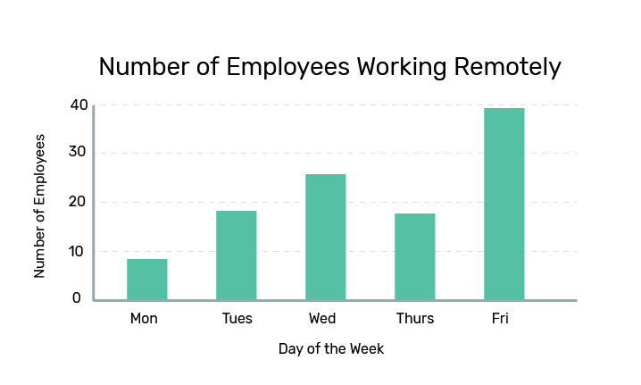
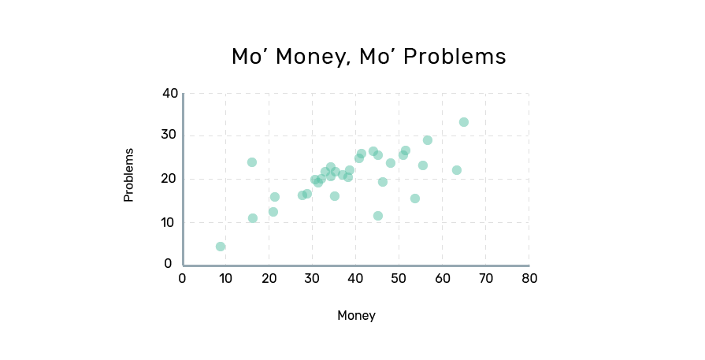

<helmet>
<title> Data Overview - Aurora Design System </title>
</helmet>

# Data Overview

Data visualizations come in many forms, and are a visual means to represent a data set. The type of data visualization chosen should always be appropriate for the type of data used.

Data visualizations should aim to represent and answer one question. The goal is to provide a brief overview of the data, and tell a visual story that makes sense to the user. Graphs should be used to visually represent datasets in ways that tables cannot. If the data is easy to understand without a visualization, usually the simplest option \(a table\) is best.

## Simplicity

A general rule for data visualizations is to keep the visual elements as simple as possible. Only necessary information such as labels, values, and bars or lines should be present. A key or legend should be provided for more complex data that may have multiple colours or types of information. Colours and other visual elements should always be kept to a minimum when possible.

Visuals should only enhance the data, and should never distract. Best practices include eliminating backgrounds, lightening grids, and reducing the number of colours used in a graph.

If one graph is too complex to represent a certain dataset, the data should be represented in multiple, simple graphs.

### Multiple Formats

When you use data visualizations, it is recommended to represent the data in multiple formats where possible. Regardless of the type of visualization you use, a simple data table, or other ways of viewing the raw data, should be available somewhere on the page. This allows users to view and analyze the data in a way that makes the most sense to them, as well as easily identify individual data points.

  

      <h4 class="card-title h5">Multiple formats example</h4>

<h5 class="h3">Number of Employees Working Remotely</h5>

<table class="table">
<thead>
          <tr>
            <th scope="col">Days of the Week</th>
            <th scope="col">Number of Employees</th>
          </tr>
</thead>
<tbody>
          <tr>
            <td>Monday</td>
            <td>9</td>
          </tr>
          <tr>
            <td>Tuesday</td>
            <td>19</td>
          </tr>
          <tr>
            <td>Wednesday</td>
            <td>25</td>
          </tr>
          <tr>
            <td>Thursday</td>
            <td>18</td>
          </tr>
          <tr>
            <td>Friday</td>
            <td>39</td>
          </tr>
</tbody>
</table>
<h5>Employees working remotely</h5>

With new digital technologies, it is easier for employees to work from home or other locations across the globe. Our team takes a digital-first approach which means employees are able to work from anywhere, anytime. Most employees tend to work outside the office on Wednesdays and Fridays.

  

## Labels

### Graph Titles

Graph and table titles in this design system use the typography style for [heading 2. ](/component/typography)Titles should be as short as possible, and accurately reflect the question the dataset is trying to represent. Titles always use title-case capitalization.

### Axis Labelling

Both the x and y-axes should always be labeled. Labels should be placed outside of the data area. Labels should use simple and clear language, and accurately represent the data being shown. Axis labels use the typographic style for[ heading 4](/component/typography).

For quantitative labels, the unit of measurement should be included in the label.

### Data Increments

Qualitative data values should be labelled in a logical way, such as consecutive months. For quantitative values, they should be labelled using round numbers or decimals that fit the data range. Always include an additional increment greater than the dataset. For quantitative values, axes should always start at 0. When using decimals, round to a maximum of two decimal points whenever possible.

In some visualizations with many axis points, skipping labels is an effective way to reduce visual clutter. Axis ticks should be separated with sufficient space to clearly read each label. Intervals between labels should always be consistent.

On the x-axis, value labels should be centered to their corresponding tick mark. For y-axis labels, they should be left-aligned and kept above the y-axis lines. Long text labels should be rotated 45 degrees around an origin directly below their corresponding axis tick.

### Data Formats and Abbreviations

When possible, labels and values should avoid abbreviations unless it is a conventional data format. If spacing is a concern, it is recommended to skip labels in a way that makes sense for the data.

Some data formats should always use abbreviations:

<h4 class="h3">Common Abbreviations</h4>
<table class="table">
  <thead>
    <tr>
      <th scope="col">Unit</th>
      <th scope="col">Abbreviations</th>
    </tr>
  </thead>
  <tbody>
    <tr>
      <td>Days of the week</td>
      <td>Mon, Tues, Wed, Thurs, Fri, Sat, Sun</td>
    </tr>
    <tr>
      <td>Months</td>
      <td>Jan, Feb, Mar, Apr, May, Jun, Jul, Aug, Sep, Oct, Nov, Dec</td>
    </tr>
    <tr>
      <td>12-hour time</td>
      <td>1 a.m., 2 p.m., 12 p.m. etc.</td>
    </tr>
    <tr>
      <td>Standard money abbreviations</td>
      <td>$1.2k, $3.4m, $6.2b, etc.</td>
    </tr>
  </tbody>
</table>

## Colours and Textures

Graphs and visualizations should always aim to use as little colour as possible. If multiple colours are required, they should be a complimentary palette that are both distinguishable when placed in close proximity. Colour choice should avoid bias \(e.g. red and green\) unless specifically related to the data. Any colour is acceptable for a visualization so long as it meets contrast requirements.

For increased accessibility, it is also recommended to use textures in addition to colour differences, so that variables are easier to distinguish.

See specific types of visualizations for use of colour. In general, each variable should have one designated colour, and only graphs showing multiple variables should have multiple colours.

Axis lines should use light grey \(<badge style="background-color: #E0E0E0;color:black">#E0E0E0</badge>\), to not distract from other colours used in the visualization

For more information about colour choice, visit the [colour section](/component/colour).
