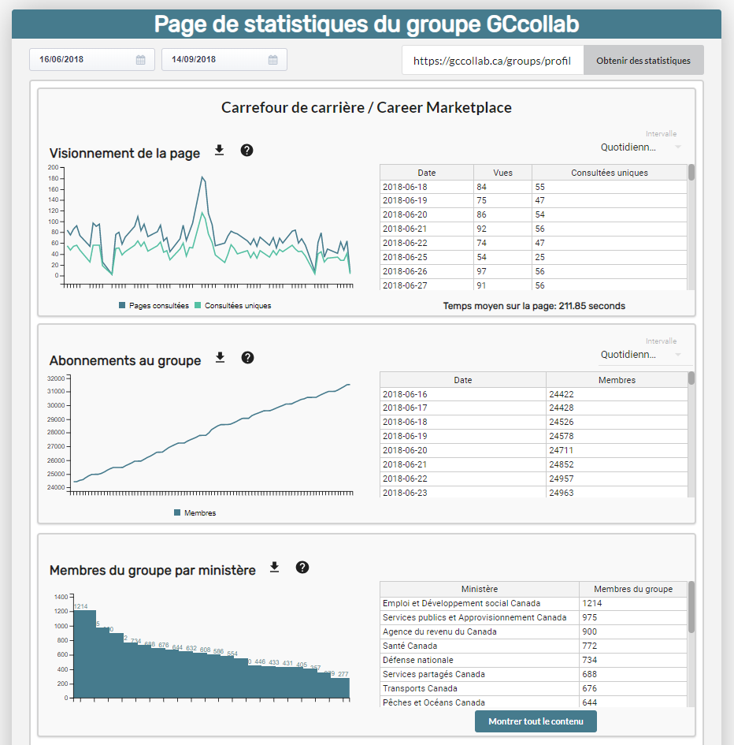
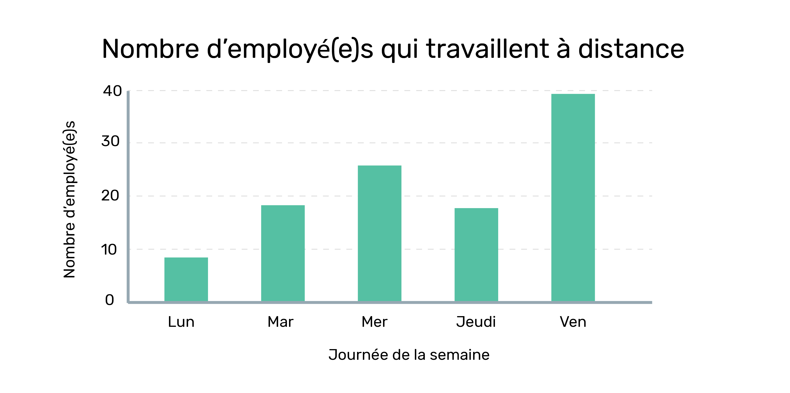
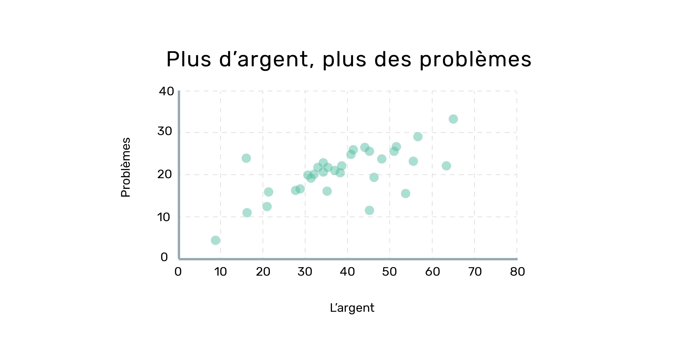

<helmet>
<title> Aperçu - Système de conception Aurora </title>
</helmet>

# Aperçu

La visualisation des données prend de nombreuses formes et constitue un moyen visuel de représenter un jeu de données.

La visualisation des données devrait viser à représenter et à répondre à une seule question. Le but est de donner un aperçu des données et de raconter une histoire visuelle qui a du sens pour l’utilisateur. Les graphes devraient servir à représenter des jeux de données d’une manière dont les tableaux ne peuvent pas. Si les données sont faciles à comprendre sans visualisation, habituellement l’option la plus simple (un tableau) est la meilleure.

*L'application des statistiques GCcollab, qui utilise le système de conception d'Aurora pour créer un page de statistiques des groupes GCcollab*

## Simplicité
Pour ce qui est de la visualisation des données, il faut en règle générale garder les éléments visuels aussi simples que possible. Seuls les renseignements nécessaires tels les étiquettes, les valeurs et les barres ou les lignes devraient s’y trouver. Une clé ou une légende devrait être fournie pour les données plus complexes qui peuvent avoir plusieurs couleurs ou types d’information. Les couleurs et autres éléments visuels doivent toujours être maintenus au minimum dans la mesure du possible.

Les éléments visuels ne devraient que mettre en valeur les données et ne devraient jamais distraire. Les pratiques exemplaires comprennent l’élimination de l’arrière-plan, l’allégement du quadrillage et la réduction du nombre de couleurs utilisées dans un graphique.

Si un graphique est trop complexe pour représenter un certain jeu de données, les données devraient être représentées dans plusieurs graphiques simples.

### Formats multiples
Lorsque vous utilisez des visualisations de données, il est recommandé de représenter les données dans plusieurs formats dans la mesure du possible. Peu importe le type de visualisation que vous utilisez, un simple tableau de données ou d’autres façons de publier les données brutes, devrait se trouver quelque part sur la page, ce qui permet aux utilisateurs de visualiser et d’analyser les données de la façon qui leur convient, ainsi que d’identifier facilement les points de données individuels.

## Étiquettes

### Titres de graphique

Les titres de graphique et de tableau dans ce système de conception utilisent le style télégraphique pour l’en-tête 2. Les titres devraient être aussi courts que possible et prendre en compte de façon précise la question qu’on tente de représenter par le jeu de données. Les titres sont toujours en majuscules.

### Étiquetage des axes
Les axes x et y doivent toujours être étiquetés. Les étiquettes devraient être placées à l’extérieur de la zone de données. Les étiquettes sont toujours en langage simple et clair et ils représentent avec exactitude les données illustrées. Les étiquettes des axes sont en style typographique pour l’en-tête 4.

Pour les étiquettes quantitatives, l’unité de mesure devrait être incluse dans l’étiquette.

### Incréments de données

Les valeurs qualitatives des données devraient être étiquetées de façon logique, comme les mois consécutifs. Pour les valeurs quantitatives, elles devraient être étiquetées à l’aide de nombres arrondis qui entrent dans la plage de données. Il faut toujours inclure un incrément additionnel plus élevé que le jeu de données. En ce qui concerne les valeurs quantitatives, les axes doivent commencer par zéro. Si des décimales sont utilisées, il faut les arrondir à un maximum de deux points de décimale dans la mesure du possible.

Dans certaines visualisations comportant de nombreux axes, l’omission d’étiquettes est un moyen efficace de réduire l’encombrement visuel. Les lignes guides des axes doivent être séparées avec suffisamment d’espace pour lire clairement chaque étiquette. Les intervalles entre les étiquettes devraient être cohérents.

Sur l’axe des x, les étiquettes de valeur devraient être centrées à la ligne guide correspondante. En ce qui concerne les étiquettes de l’axe des y, elles devraient être alignées à gauche et se trouver au-dessus des lignes de l’axe des y. Les longues étiquettes de texte doivent être tournées de 45 degrés autour d’une origine directement sous la ligne guide de l’axe correspondante.

### Formats des données et abréviations

Dans la mesure du possible, il faut éviter les abréviations pour les étiquettes et les valeurs, à moins qu’ils soient dans un format de données conventionnel. Si l’espacement est une préoccupation, il est recommandé d’omettre des étiquettes de manière logique pour les données.

Il faut toujours utiliser des abréviations pour certains formats de données.

<table class="table">
  <thead>
    <tr>
      <th scope="col">Jours de la semaine</th>
      <th scope="col">lun, mar, mer, jeu, ven, sam, dim</th>
    </tr>
  </thead>
  <tbody>
    <tr>
      <td>Mois</td>
      <td>janv, févr, mar, avr, mai, jun, juil, aoû, sept, oct, nov, déc</td>
    </tr>
    <tr>
      <td>Heures</td>
      <td>1 h, 14 h, 12 h, etc.</td>
    </tr>
    <tr>
      <td>Abréviations monétaires standard</td>
      <td>1,2 K$, 3,4 M$, 6,2 G$, etc.</td>
    </tr>
  </tbody>
</table>

<codeblock html='
    <table class="table">
      <thead>
        <tr>
          <th scope="col">Jours de la semaine</th>
          <th scope="col">lun, mar, mer, jeu, ven, sam, dim</th>
        </tr>
      </thead>
      <tbody>
        <tr>
          <td>Mois</td>
          <td>janv, févr, mar, avr, mai, jun, juil, aoû, sept, oct, nov, déc</td>
        </tr>
        <tr>
          <td>Heures</td>
          <td>1 h, 14 h, 12 h, etc.</td>
        </tr>
        <tr>
          <td>Abréviations monétaires standard</td>
          <td>1,2 K$, 3,4 M$, 6,2 G$, etc.</td>
        </tr>
      </tbody>
    </table>
' react=''>

## Couleurs et textures
Les graphiques et les visualisations devraient toujours comporter aussi peu de couleurs que possible. Si plusieurs couleurs sont requises, elles devraient être dans une palette complémentaire pour qu’elles se distinguent lorsqu’elles sont placées à proximité. Pour le choix de la couleur, il faut éviter le préjugé (p. ex., rouge ou vert), sauf s’il est spécifiquement lié aux données (une diminution ou une augmentation, par exemple). Toute couleur est acceptable pour une visualisation pourvu qu’elle réponde aux exigences de contraste.

Pour une accessibilité accrue, il est également recommandé d’utiliser en plus des différences de texture pour que les variables soient plus faciles à distinguer.

Voir les types précis de visualisation pour l’utilisation des couleurs. En général, chaque variable devrait compter une couleur désignée, et seulement les graphiques montrant plusieurs variables devraient être de plusieurs couleurs.

Les lignes d’axe devraient être en gris clair \(<badge style="background-color: #E0E0E0;color:black"> #E0E0E0</badge>\) pour ne pas laisser distraire le lecteur par les autres couleurs utilisées dans la visualisation.

Pour obtenir de plus amples renseignements sur le choix des couleurs, veuillez consulter la [section sur les couleurs.](couleur.md)
